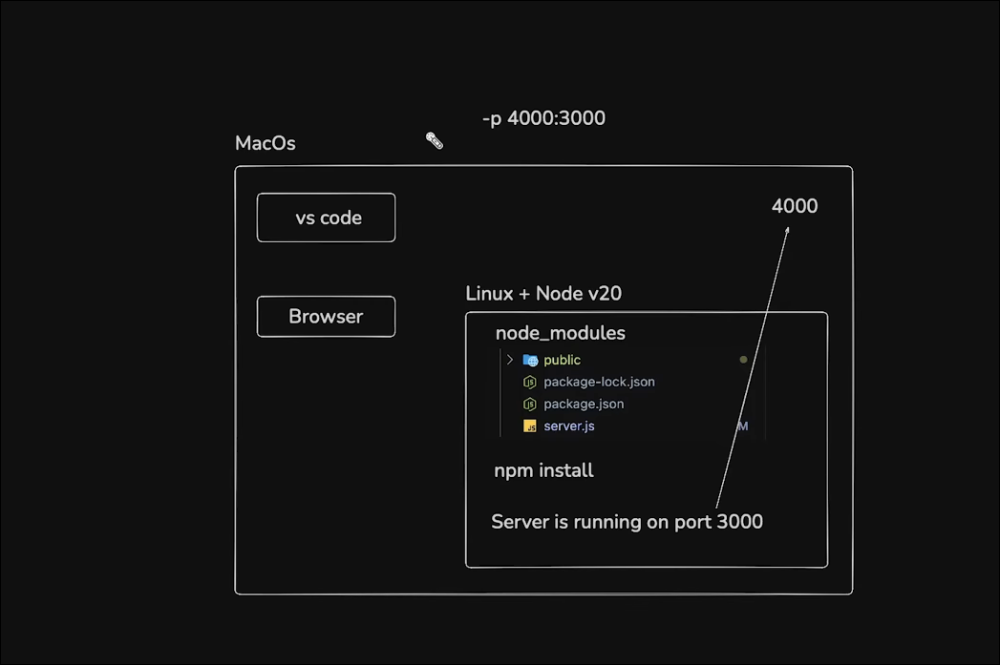

# Deployment_Become_Developer

A real-time collaborative code editor built with React, Monaco Editor, Yjs, Socket.IO, and Express.

This project allows multiple users to join the same editing session, type in a shared document, and see who is currently active in the workspace.

## Features

- Real-time collaborative editing
- Username-based join flow
- Active users list in the sidebar
- Shared document synchronization using Yjs and Socket.IO
- Fast frontend setup with Vite
- Lightweight Express backend for WebSocket coordination

## Tech Stack

- Frontend: React, Vite, Monaco Editor, Tailwind CSS
- Backend: Node.js, Express, Socket.IO
- Real-time sync: Yjs, y-socket.io, y-monaco

## Project Structure

```text
Deployment_Become_Developer/
├── README.md
├── time.md
└── docker-aws/
    ├── Backend/
    │   ├── package.json
    │   └── server.js
    └── Frontend/
        ├── package.json
        ├── vite.config.js
        └── src/
            ├── main.jsx
            └── app/
                ├── App.css
                └── App.jsx
```

## Prerequisites

Before running the project, make sure you have the following installed:

- Node.js (v18 or later recommended)
- npm

## Getting Started

### 1. Install Backend Dependencies

```bash
cd docker-aws/Backend
npm install
```

### 2. Start the Backend Server

```bash
npm run dev
```

The backend runs on port 3000 by default.

### 3. Install Frontend Dependencies

```bash
cd ../Frontend
npm install
```

### 4. Start the Frontend

```bash
npm run dev
```

The frontend runs on the Vite default port 5173.

## Access the App

Open the following URL in the browser:

```text
http://localhost:5173
```

Enter a username to join the editing room. Open the same page in another browser tab or another browser to test real-time collaboration.

## Backend Endpoints

The Express server exposes basic health endpoints:

- `GET /` -> Returns a JSON message indicating that the server is running
- `GET /health` -> Returns the server health status

## Useful Commands

### Backend

```bash
npm run dev
npm start
```

### Frontend

```bash
npm run dev
npm run build
npm run preview
```

## Notes

- The backend is configured to use Socket.IO and Yjs collaboration.
- The frontend uses Monaco Editor for code editing and a user list to show connected collaborators.
- For local development, the backend should be running before you test the shared session features.

## Future Improvements

Potential improvements for this project include:

- Support for multiple rooms or documents
- Better user presence and cursor tracking
- Authentication and authorization
- Docker setup for one-command local deployment
- Production deployment configuration
